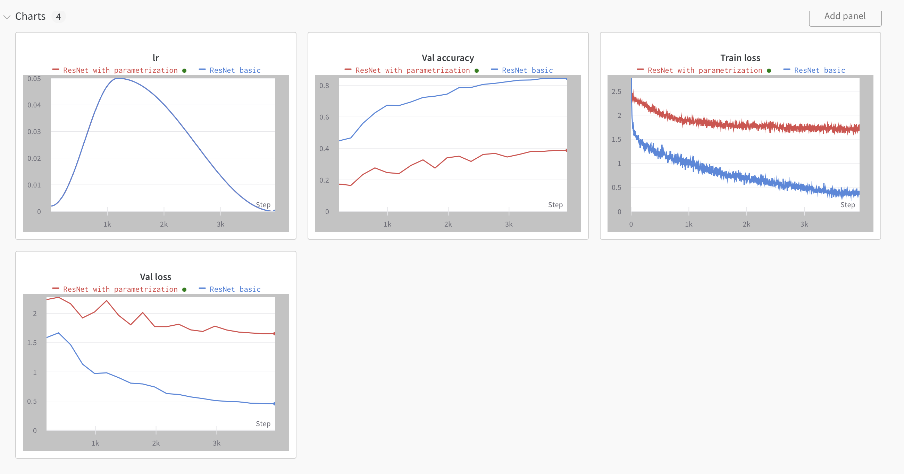

## ResNet18, simple parametrization 

### Some details 
* For demonstration purposes only ran models on 20 epochs;
* To improve accuracy, models could be fine tuned and the images could be resized to 224 x 224;
* If I understand the task correctly, in this toy example weights in MLP shoud be frozen. 

### Charts 

